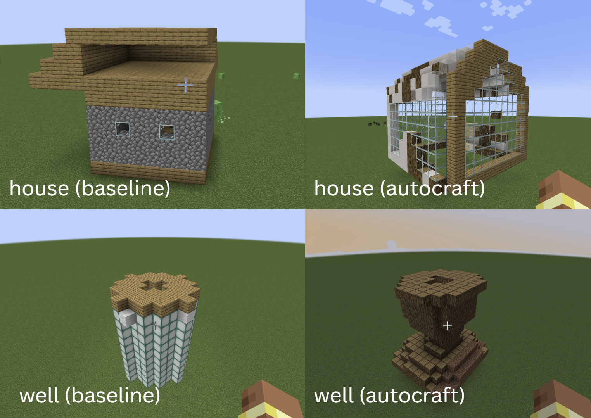

# autocraft

Text-to-Minecraft structure generation using two-stage diffusion models.

## Setup

### Installation

**Platform Support:** This project supports Linux, macOS, and Windows.

- **Linux/macOS:** Use the setup scripts directly in your terminal.
- **Windows:** Use Git Bash, WSL (Windows Subsystem for Linux), or PowerShell (with bash available).

1. **Clone the repository:**
   ```bash
   git clone https://github.com/megz14/autocraft.git
   cd autocraft
   ```

2. **Run the setup script:**
   ```bash
   bash setup.sh
   ```
   
   This will:
   - Create a conda environment named `mdlm`
   - Install all required dependencies including PyTorch with CUDA support
   - Install flash-attn for faster attention computation
   - Install all required dependencies for point-e

   **Note:** CUDA support is primarily for Linux and Windows. On macOS (especially Apple Silicon), PyTorch will use CPU or Metal acceleration.

3. **Activate the environment:**
   ```bash
   conda activate mdlm
   ```

## Model Configuration

The provided checkpoint uses a small model configuration:
- **Transformer blocks**: 12
- **Hidden dimension**: 64
- **Attention heads**: 8
- **Conditioning dimension**: 128
- **Sequence length**: 1024
- **Vocabulary size**: 45 (44 block types + 1 mask token)
- **Dropout**: 0.1

## Usage

A pre-trained checkpoint is provided. To generate a Minecraft structure from text:

```bash
python main.py \
  --text "a house" \
  --checkpoint_path="./mdlm/checkpoint/2025.12.04/021405/checkpoints/best.ckpt" \
  --output="house.npy" \
  --block_size=16
```

Note: Both relative and absolute paths are supported for `--checkpoint_path`. The `--block_size` parameter controls the voxel grid resolution (default: 16).

### Visualization Setup (MineScript)

To visualize the generated build in Minecraft, you'll need to set up MineScript:

#### 1. Install Fabric Mod Loader (for Minecraft 1.21.3)

- Visit the Fabric installer: https://fabricmc.net/use/installer/
- Download and run the installer.
- Choose:
  - **Minecraft Version:** `1.21.3`
  - **Loader Version:** Latest
- Click **Install**.

#### 2. Download Required Mods

Download the following mods (make sure they match **Minecraft 1.21.3 Fabric**):

- **Fabric API:** https://modrinth.com/mod/fabric-api
- **MineScript:** https://modrinth.com/mod/minescript

You should now have two `.jar` files.

#### 3. Install the Mods

1. Open your Minecraft mods folder:
   - **Windows:** `%APPDATA%/.minecraft/mods`
   - **Mac:** `~/Library/Application Support/minecraft/mods`
   - **Linux:** `~/.minecraft/mods`

2. Place both downloaded `.jar` files into the `mods` folder.

3. Launch Minecraft with the **Fabric** profile, then close it once it finishes loading.

#### 4. Configure MineScript

After running Minecraft once, a new folder will appear:
```
.minecraft/minescript
```

Inside this folder, find the configuration text file (e.g., `config.txt`).

Locate the setting for the Python path and change it to your installed Python location.

A typical Python path looks like:
```
C:\Users\YOUR_NAME\AppData\Local\Programs\Python\Python3XX
```

Replace **YOUR_NAME** and **Python3XX** with your actual username and Python version.

Save the file when done.

#### 5. Install the Visualization Script

After completing steps 1-4, you can automatically install the visualization script by running:

```bash
bash setup_minescript.sh
```

This script will automatically detect your Minecraft directory and copy `build_schematic.py` to the MineScript folder.

**Manual installation (optional):** If you prefer to copy it manually, the script is located at `minescript/build_schematic.py` in this repository. Copy it to:

```
.minecraft/minescript/build_schematic.py
```

You can now use this script in-game to load and visualize generated `.npy` schematic files. In Minecraft, open the chat and use the MineScript command:

```
\build_schematic /absolute/path/to/your/schematic.npy
```

**Try it out:** A sample schematic is provided at `out/well.npy`. To test the visualization:

1. Open Minecraft with the Fabric profile
2. Open the chat (press `T`)
3. Type: `\build_schematic /absolute/path/to/autocraft/out/well.npy`

Replace `/absolute/path/to/autocraft` with the actual absolute path to your cloned repository.

<video src="demo.mp4" controls width="600"></video>

## Results

### Comparison with Baseline

The following comparison shows our diffusion-based model output versus a baseline approach that uses LLMs to generate code for building Minecraft structures via Minecraft Apis:



Overall, AutoCraft exhibits stronger structural awareness, producing more varied and creative structures. The model also demonstrates better material choice and placement, using a wider range of block types in structurally meaningful ways (e.g., placing glass in window openings and maintaining coherent patterns across neighboring voxels). Occasional out-of-place blocks may occur due to the stochastic nature of the diffusion process.

## Attribution

This project uses the following third-party components:

### Point-E
- **Source**: [OpenAI Point-E](https://github.com/openai/point-e)
- **License**: MIT License
- **Copyright**: Copyright (c) 2022 OpenAI
- **Usage**: Used for text-to-3D point cloud generation (Stage 1)

### MDLM (Masked Diffusion Language Models)
- **Source**: [MDLM by Cornell University](https://github.com/s-sahoo/mdlm)
- **License**: Apache License 2.0
- **Copyright**: Copyright 2024 Cornell University
- **Usage**: Used as the diffusion model framework for block type prediction (Stage 2)